### Git stash -> 
     * bring to stage area ->  then stash 

### Git branching ->
     * do not directly commit on main branch
     * Whenever working on new feture , bug etc ->  do not work in main branch

### Upstream ->
     * From where We fork the project directory.

### Origin ->
    * repository which I have access to.
    * eg -> Forked account 

### Important point->
    * For working on every new feature , bug etc -> make new branch for it .
    * Do not directly commit in master branch
### 1 Branch allows only 1 pull requests -> then after commits will added into it.
 *  ## **For working on different fetures -> create seperate branches for it => create sepearte pull requests related to it.**  

* eval $(ssh-agent)
* ssh-add ~/.ssh/id_ed25519

## Rewritting history ->
 #### git commit --amend -> 

 
   - to make changes in the latest commit -> commit + staged_changes = new commit 
   - if no staged_changes =0 -> edit commit's message only
   - **--no-edit** flag -> amend commits without changing its commit message. 
  
  #### Changing more older commits ->

   ##### git rebase ->

     - `git rebase` ->
   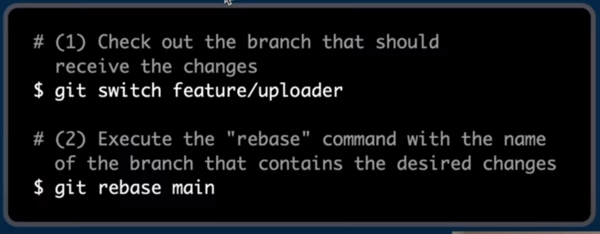

   all the changes of the feature/uploader will be on top of the main branch
     - `git rebase --interactive commit_hash^` 
     - 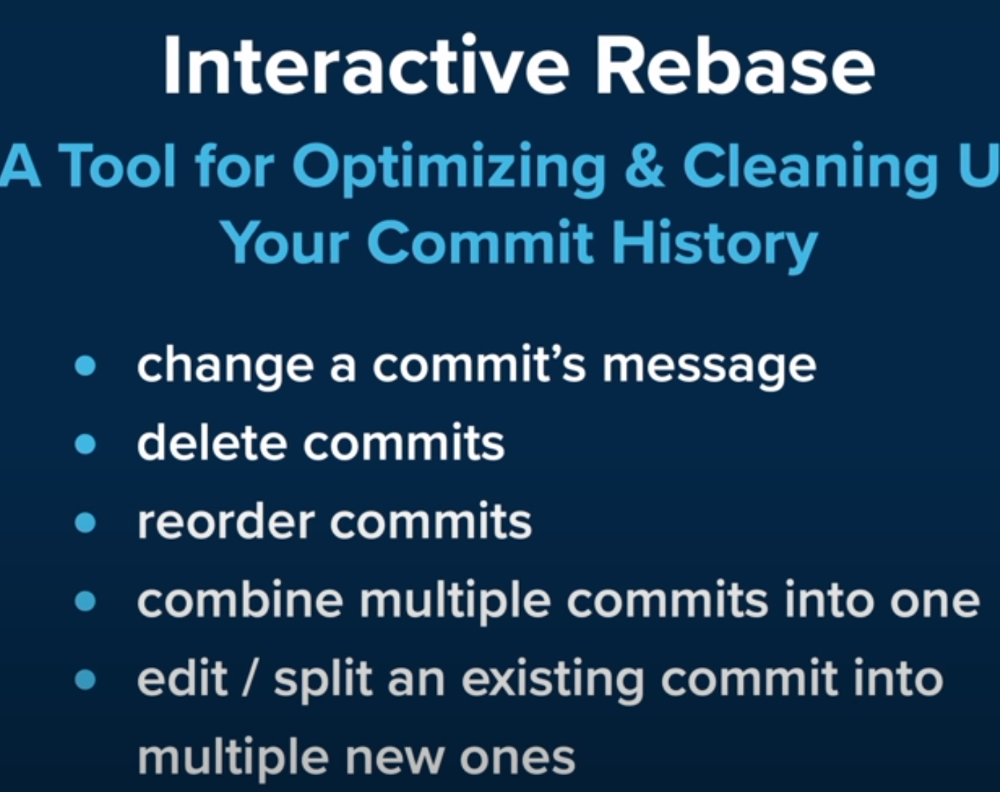
     - (^ => to include that commit also) => `edit`: to make more changes and amend it => `git rebase --continue`.
     => `reword` : to change only commit message.
     => `squash`: to combine two commits into one

#### Extra Points->
* git add -p => helps to add changes to staging area patch wise.
* git show commit_hash => show the changes
* git commit -> blank space => start body of commit

### Types of branches->
 #### Long running branches->
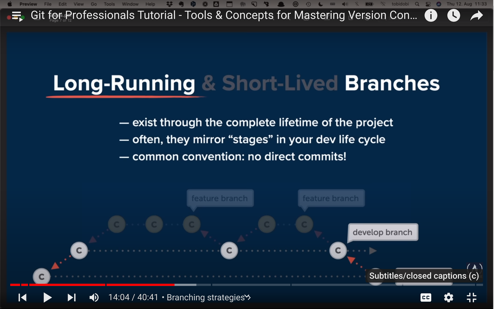
 
 #### Short running ->

  - #### Github flow ->
  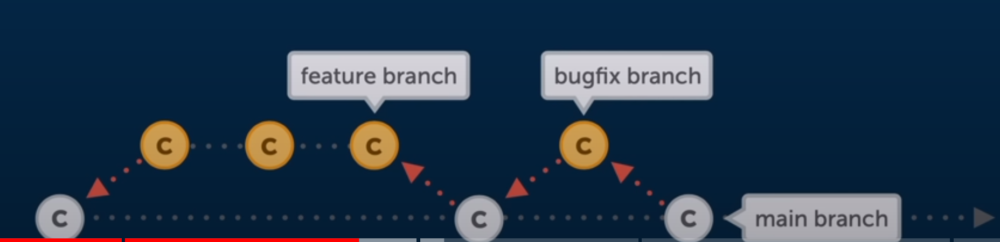
  - #### Gitflow ->
    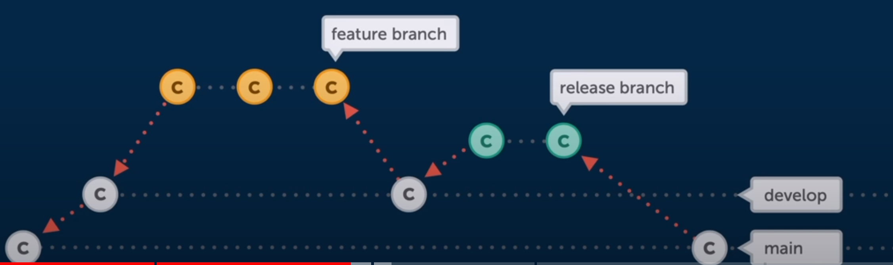

#### Merge conflict->
 - 2 branches A and B -> both has done diff work in a same file -> merging them -> conflict git which to choose -> manually decide them    
   - ##### Merge-> 
   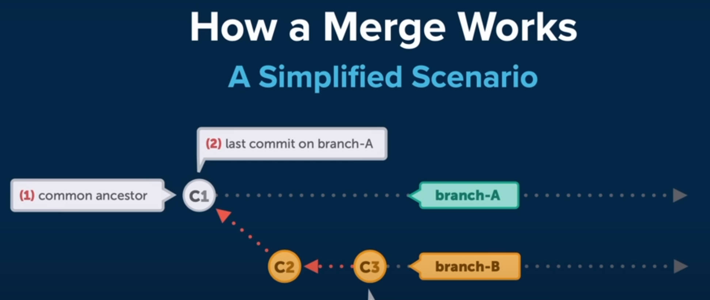
   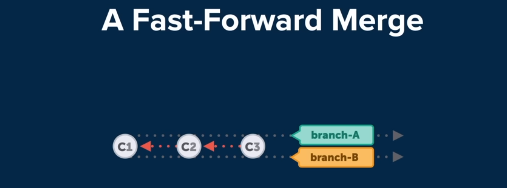
   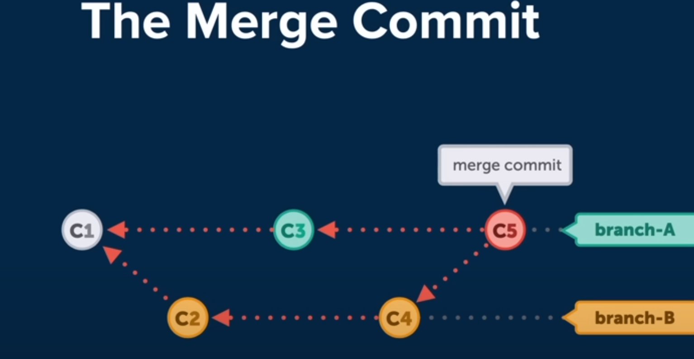
    - * Merge commit -> used to know two branches commits 
                    

### Push the change in remote->
  - checkout that branch
  - Commit Your Changes:
  - Push Changes to Remote Repository -> `git push origin your_branch_name`

         |
         if it is first time -> `git push -u origin your_branch_name`(tracking changes(easy pull or push)) -> then can write `git push`                                                 
                                                                 
      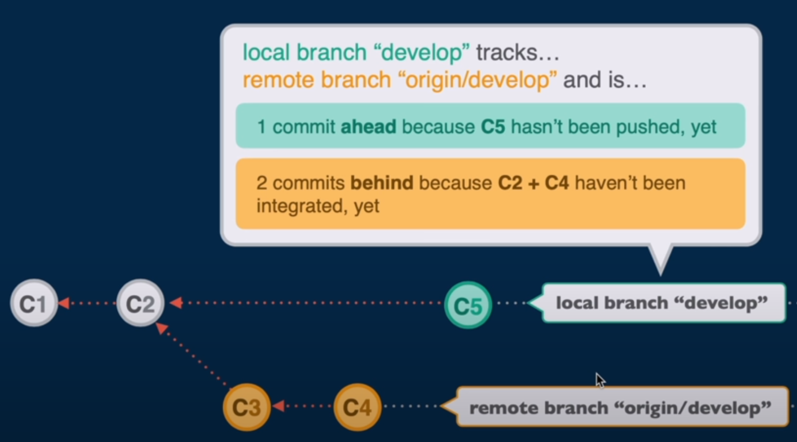

### Get branch from remote repo(origin) -> local:
 `git branch --track branch_name origin/branch_name`
`git checkout --track origin/branch_name`

#### deleting a branch in remote ->
 `git push origin -delete branch_name`

#### Comparing two branches ->
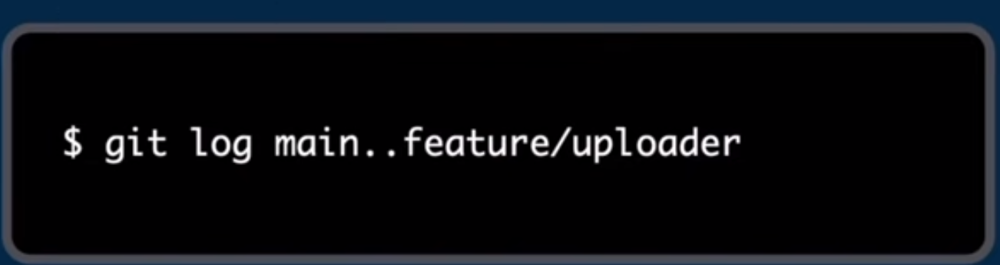

- commits which are not in main but in feature/uploader 

### Cherry-Pick ->
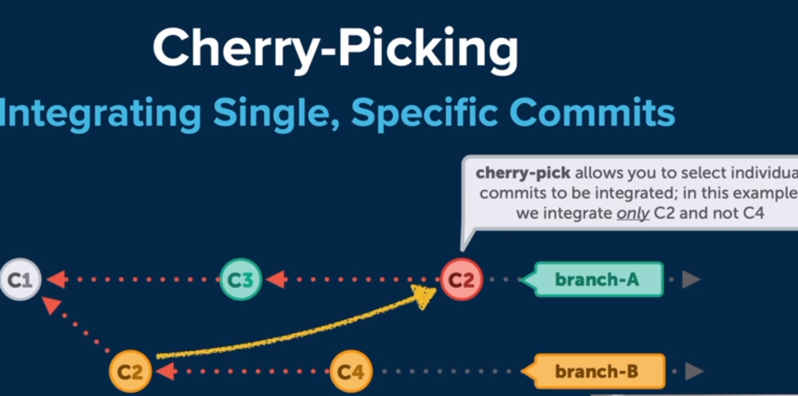

- helps to move a specific commit from one branch to another
- First go to branch where you want commit to move into ->  `git cherry-pick commit_hash`
- **into the head**

### Reflog->
- journal of all git actions
  
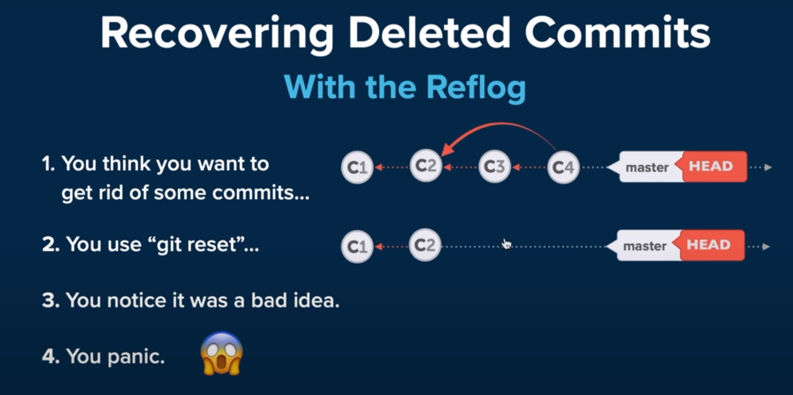
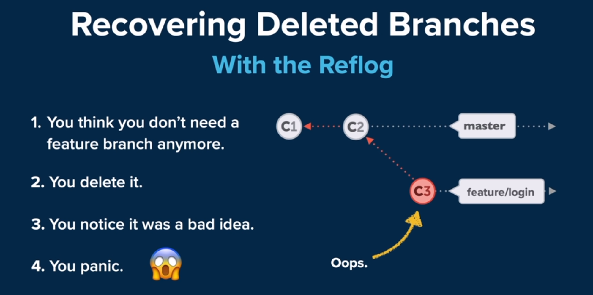

<!-- hello -->
This is a first commit.
This is a second commit